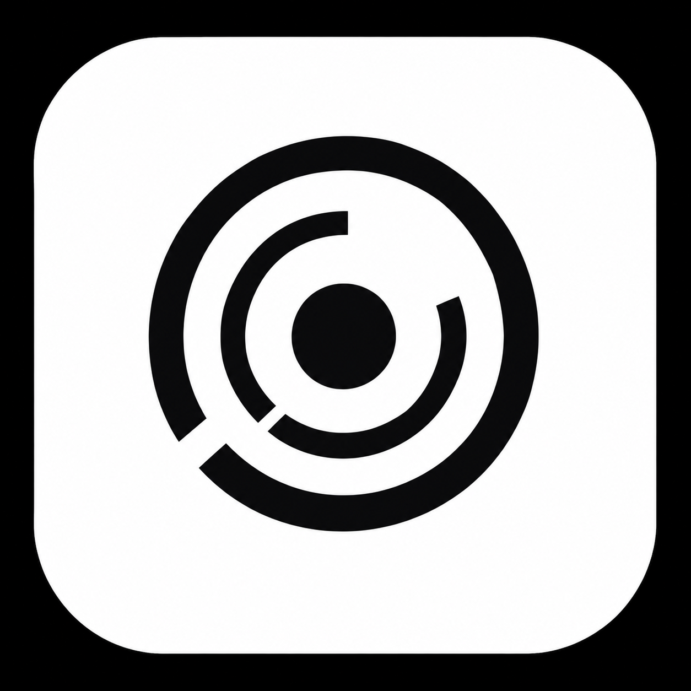

<p align="center">
  
  <h1 align="center">LOCUS</h1>
</p>
<p align="center">
  <strong>Unified, Air-Gapped Multi-Vendor CCTV & DVR Forensic Analysis Workstation</strong><br>
  <em>Engineered for Law Enforcement, Intelligence Agencies, and Digital Forensics Laboratories</em>
</p>

<p align="center">
  
  
  
  
  
  
  
  
</p>

---

## 📌 Executive Summary

**LOCUS** is an air-gapped, high-performance digital forensics workstation purpose-built to solve surveillance video evidence fragmentation in criminal investigations and defense operations.

Modern CCTV surveillance systems (e.g., **Dahua, Hikvision, CP Plus, Honeywell, TP-Link, WFS, and Uniview**) write surveillance feeds to raw hard drives using proprietary disk layouts, non-standard sector headers, unallocated cluster interleaving, and custom video container wrappers. When systems are damaged, formatted, or seized during an investigation, standard operating systems fail to recognize the filesystem, and conventional video players cannot decode the fragmented streams.

**LOCUS** replaces cumbersome vendor-locked proprietary players with a single, unified, courtroom-defensible platform:
- **Direct Bitstream Ingestion & Cloning:** Ingests raw `.dd` / `.raw` disk images or clones physical block devices via `dc3dd` with real-time SHA-256 and MD5 dual-hashing.
- **Automated OEM Signature Probing:** Identifies proprietary magic headers (`DHAV`, `DHFS`, `HKFS`, `HIKB`, `WFS`, etc.) and unpacks 32-byte frame metadata without touching file access dates.
- **Zero-Transcode Video Carving:** Carves raw H.264/H.265 NAL streams and remuxes them to `.mp4` container slices with zero transcoding loss.
- **60 Hz Synchronized Multi-Camera Grid:** Normalizes clock drift across independent camera channels into a unified master timeline.
- **Offline AI Video Intelligence:** Accelerates triage by up to 10× using OpenCV MOG2 motion gating and offline YOLOv8 neural inference.
- **Local Small Language Model (SLM) Copilot:** Integrates an offline Qwen2.5-1.5B INT4 ONNX copilot for natural language investigation queries, automated action dispatching, and playhead seeking.
- **Statutory Admissibility (BSA 2023 Section 63):** Generates court-ready PDF evidence packages, immutable cryptographic provenance receipts (`.sync.json`), and SHA-256 numbered I-frame stills for charge sheet annexures.

> **Target Organization:** National Technical Research Organisation (NTRO)  
> **Problem Statement ID:** PS 26150 (Cybersecurity & Digital Forensics)  
> **Developed by:** Team ForenSight

---

## 📑 Table of Contents

- [📌 Executive Summary](#-executive-summary)
- [🎯 Key Features](#-key-features)
- [🏗️ System Architecture](#️-system-architecture)
- [💻 Tech Stack](#-tech-stack)
- [⚙️ Prerequisites & System Requirements](#️-prerequisites--system-requirements)
- [🚀 Installation & Setup](#-installation--setup)
- [🖥️ Usage & Forensic Workflow](#️-usage--forensic-workflow)
- [🧪 Automated Test Suite](#-automated-test-suite)
- [🧭 Roadmap & Milestones](#-roadmap--milestones)
- [🤝 Contributing Guidelines](#-contributing-guidelines)
- [⚖️ Legal Admissibility & Statutory Compliance](#️-legal-admissibility--statutory-compliance)
- [📄 License & Authors](#-license--authors)
- [🙏 Acknowledgements](#-acknowledgements)

---

## 🎯 Key Features

### 1. Physical Acquisition & Bitstream Ingestion
- Live physical disk cloning via integrated `dc3dd` with hardware write-blocker detection and bad-sector recovery.
- Direct ingestion of uncompressed bitstream raw disk images (`.dd`, `.raw`, `.img`, `.bin`).
- Dual streaming cryptographic calculation of `SHA-256` and `MD5` fingerprints at intake.

### 2. Automated OEM & Filesystem Reverse Engineering
- 2-phase binary prober scanning 512-byte sector blocks for proprietary magic signatures.
- Supported OEM signatures:
  - **Dahua / CP Plus:** `DHAV`, `DHFS`
  - **Hikvision:** `HKFS`, `HIKB`, `HIKBTREE`
  - **Embedded / Generic:** `WFS` (v0.1 – v0.4), standard FAT32, exFAT, ext4, and raw H.264/H.265 Annex-B NAL units.
- Unpacks 32-byte binary frame envelopes to reconstruct camera channel IDs, absolute timestamps, GOP structures, and sector spans into an SQLite Master Sector Map.

### 3. Sector-Level Video Carving & Stream Remuxing
- Bypasses deleted, damaged, or formatted partition tables.
- Carves raw elementary video streams by stripping proprietary wrappers.
- Performs I-frame / GOP snap-alignment and fast-start `.mp4` remuxing using PyAV and FFmpeg with zero transcoding (original bitstream integrity is 100% preserved).
- Built-in HTTP 206 Partial Content streaming server supporting microsecond-precise frame stepping.

### 4. 60 Hz Synchronized Multi-Camera Master Grid
- Solves heterogeneous DVR clock drift non-destructively through offset calibration matrices.
- Synchronous playback of 4, 9, or 16 camera channels locked to a single master clock bus.
- Playback controls: pause, scrub, single-frame advance (`1 Fr`), and variable speeds (0.25× to 16×).

### 5. Offline Motion-Gated AI Video Intelligence
- **Motion Pre-Filter:** OpenCV MOG2 background subtractor detects motion voids, skipping inactive scenes to provide up to 10× triage speedup.
- **Local Neural Inference:** Embedded YOLOv8 neural network running via ONNX Runtime for CPU/GPU detection of:
  - Persons / Suspects
  - Automobiles, Trucks & Vans
  - Backpacks, Handbags & Luggage
- **Instant Triage:** Detection cards populate with confidence ratings and bounding boxes; clicking any detection jumps the video playhead instantly to that exact frame.

### 6. Local Offline SLM Forensic Copilot
- Powered by **Qwen2.5-1.5B-Instruct ONNX (INT4)** running 100% locally on CPU/GPU.
- Zero network reliance or external API calls.
- Natural language intent extraction and tool-calling registry:
  - `seek_player`: Automates navigation and jumps the timeline to specific camera timestamps.
  - `search_detections`: Filters AI detection logs based on conversational queries.
  - `get_case_summary`: Aggregates case metadata, hash parity, and channel status.
  - `prepare_export`: Stages court-ready time-slice exports directly from chat.
- Slide-over chat drawer accessible instantly via `Ctrl + Space` or `Alt + C`.

### 7. Evidence Export, Hashing & Court Admissibility
- Zero-transcoding sub-clip time-slicing (`-c:v copy`).
- Mandatory investigator justification logging before export execution.
- Generates cryptographically verifiable `.sync.json` HMAC sidecar receipts containing source hash linkage, frame offsets, and officer signatures.
- Formats evidence for statutory compliance under **Section 63 of the Bharatiya Sakshya Adhiniyam (BSA 2023)**.

### 8. Immutable Audit Trail & PDF Dossier Generator
- Append-only SQLite legal audit ledger logging every investigator action, hash check, and filter query.
- Automated generation of court-ready PDF forensic dossiers featuring:
  - Chain of custody tracking and officer credentials.
  - Evidence intake hash parity tables.
  - Multi-camera calibration logs.
  - AI detection summaries and forensic I-frame stills.
  - Section 63 BSA electronic record certificate.

---

## 🏗️ System Architecture

LOCUS is engineered as a monorepo desktop application. A native Electron desktop shell wraps a modern React SPA frontend communicating with a high-performance local FastAPI Python backend engine over internal IPC / loopback REST and Server-Sent Events (SSE).

```
┌─────────────────────────────────────────────────────────────────────────────┐
│                        LOCUS ELECTRON DESKTOP SHELL                         │
│                                                                             │
│  ┌───────────────────────────────────────────────────────────────────────┐  │
│  │                    REACT 19 + SHADCN / TAILWIND UI                    │  │
│  │  ┌──────────────────┐  ┌──────────────────┐  ┌─────────────────────┐  │  │
│  │  │ Forensic Cases   │  │ Room 1: Multi-Cam│  │ Room 2: AI Video    │  │  │
│  │  │ Hub & Dossiers   │  │ Synchronized Grid│  │ Intelligence       │  │  │
│  │  └──────────────────┘  └──────────────────┘  └─────────────────────┘  │  │
│  │  ┌──────────────────┐  ┌──────────────────┐  ┌─────────────────────┐  │  │
│  │  │ Room 3: Export   │  │ Room 4: Immutable│  │ Local SLM Copilot   │  │  │
│  │  │ & Cryptographic  │  │ Audit Ledger     │  │ (Qwen2.5 Slide-over)│  │  │
│  │  └──────────────────┘  └──────────────────┘  └─────────────────────┘  │  │
│  └───────────────────────────────────┬───────────────────────────────────┘  │
└──────────────────────────────────────┼──────────────────────────────────────┘
                                       │ HTTP / REST & SSE (127.0.0.1:8000)
                                       ▼
┌─────────────────────────────────────────────────────────────────────────────┐
│                        FASTAPI PYTHON BACKEND ENGINE                        │
│                                                                             │
│  ┌───────────────────────────────────────────────────────────────────────┐  │
│  │ 01. Acquisition Engine (dc3dd + streaming SHA-256 / MD5 hasher)       │  │
│  ├───────────────────────────────────────────────────────────────────────┤  │
│  │ 02. Filesystem & OEM Prober (DHAV, HKFS, WFS magic byte signatures)   │  │
│  ├───────────────────────────────────────────────────────────────────────┤  │
│  │ 03. Binary Header Parser (32-byte frame envelopes & Master Sector Map)│  │
│  ├───────────────────────────────────────────────────────────────────────┤  │
│  │ 04. Video Carver & Demuxer (PyAV / FFmpeg zero-transcode remuxing)    │  │
│  ├───────────────────────────────────────────────────────────────────────┤  │
│  │ 05. 60 Hz Timeline Synchronization Engine & Clock Drift Calibrator    │  │
│  ├───────────────────────────────────────────────────────────────────────┤  │
│  │ 06. AI Vision Pipeline (OpenCV MOG2 Motion Gating + YOLOv8 ONNX)      │  │
│  ├───────────────────────────────────────────────────────────────────────┤  │
│  │ 07. Local SLM Copilot (Qwen2.5-1.5B INT4 ONNX Runtime GenAI)          │  │
│  ├───────────────────────────────────────────────────────────────────────┤  │
│  │ 08. Cryptographic Slicer & HMAC-signed .sync.json Sidecar Generator   │  │
│  ├───────────────────────────────────────────────────────────────────────┤  │
│  │ 09. ReportLab PDF Engine (BSA 2023 Section 63 Admissibility Bundle)   │  │
│  └───────────────────────────────────┬───────────────────────────────────┘  │
│                                      │                                      │
│                                      ▼                                      │
│                        ┌───────────────────────────┐                        │
│                        │ Local SQLite Database     │                        │
│                        │ (`data/forensics.db`)     │                        │
│                        └───────────────────────────┘                        │
└─────────────────────────────────────────────────────────────────────────────┘
```

---

## 💻 Tech Stack

| Layer | Component | Technologies Used |
| :--- | :--- | :--- |
| **Desktop Shell** | Native Windowing & Lifecycle | **Electron 44**, Node.js 20+, cross-env |
| **Frontend Framework** | UI Application & State | **React 19**, **TypeScript 5.x / 6.x**, **Vite 6** |
| **Styling & Design System** | Components & Aesthetics | **Tailwind CSS 4**, **Shadcn UI**, Base-UI, Lucide, Remixicon |
| **Client State Management** | Data Caching & Real-time | **Zustand 5**, **TanStack Query 5**, TanStack Form |
| **Backend API** | High-Concurrency Server | **FastAPI 0.141**, **Uvicorn**, Pydantic 2.x, SQLModel / SQLAlchemy 2.0 |
| **Database** | Embedded Storage | **SQLite 3** (`data/forensics.db`) |
| **Video Carving & Decoding** | Demuxing & Remuxing | **PyAV**, **FFmpeg**, Python binary `struct` unpacking |
| **Computer Vision AI** | Motion Gating & Object Detection | **OpenCV 5.0 (Headless)**, **ONNX Runtime 1.29**, YOLOv8 Nano |
| **Forensic SLM AI** | Offline Assistant & Tool Calling | **Qwen2.5-1.5B-Instruct ONNX (INT4)**, **ONNX Runtime GenAI 0.15** |
| **Physical Acquisition** | Disk Imaging & Hashing | `dc3dd`, Python `hashlib` (SHA-256 + MD5), PyWin32 / Linux `dd` |
| **Reporting & Export** | Courtroom PDF Generation | **ReportLab 5.0**, HMAC-SHA256 JSON provenance sidecars |
| **Package & Build Tooling**| Toolchain & Bundling | **pnpm** (workspaces), **uv** (Python package manager), **PyInstaller** |

---

## ⚙️ Prerequisites & System Requirements

### Hardware Requirements

| Metric | Minimum (Evaluation & Laptops) | Recommended (Forensic Workstation) |
| :--- | :--- | :--- |
| **Operating System** | Windows 10/11 (64-bit) or Ubuntu 20.04+ LTS | Windows 11 Pro (64-bit) or Ubuntu 22.04 LTS |
| **Processor** | Quad-core Intel Core i5 / AMD Ryzen 5 | 8-core Intel Core i7/i9 or AMD Ryzen 7/9 |
| **System Memory (RAM)** | 8 GB RAM | 16 GB – 32 GB RAM |
| **Local Storage** | 10 GB free SSD space for app & models | High-speed NVMe SSD (200 GB+ for raw image carving) |
| **GPU Acceleration** | Integrated GPU (CPU inference via ONNX) | NVIDIA GeForce RTX 3060+ / Quadro (CUDA acceleration) |

### Software Prerequisites
- **Node.js:** `v20.10.0` or higher
- **pnpm:** `v9.0.0` or higher (`npm install -g pnpm`)
- **Python:** `3.11` to `3.14` (Managed automatically via **`uv`**)
- **FFmpeg:** Installed and accessible in system PATH
- **dc3dd:** *(Optional for physical cloning)* Installed in system PATH or bundled in `backend/bin/`

---

## 🚀 Installation & Setup

### 1. Clone the Monorepo
```bash
git clone https://github.com/rehanhalai/locus.git
cd locus
```

### 2. Install Dependencies (Single Command)
LOCUS utilizes `pnpm` workspaces for the frontend and Electron shell, and Astral's `uv` for lightning-fast Python virtual environment management:

```bash
# Installs root, Electron, and frontend node_modules, then triggers `uv sync` in backend
pnpm run setup
```

Alternatively, set up components independently:
```bash
# Setup Frontend & Electron
pnpm install

# Setup Backend Environment
cd backend
uv sync
cd ..
```

### 3. Initialize Local Forensic Database
```bash
pnpm run db:reset
```

### 4. Configure Environment Variables (Optional)
Check and update `backend/.env` if custom storage paths or ports are needed:
```ini
APP_NAME="LOCUS Forensic Workstation"
ENVIRONMENT="development"
PORT=8000
DATABASE_URL="sqlite:///data/forensics.db"
EVIDENCE_STORAGE_PATH="./data/evidence"
MODELS_DIR="./models"
```

---

## 🖥️ Usage & Forensic Workflow

### Launching in Development Mode

#### Option A: Full Desktop Application (Electron + React + FastAPI)
```bash
pnpm run dev:desktop
```
This automatically spins up the Vite development server, launches the embedded FastAPI engine, and opens the native Electron forensic workstation window.

#### Option B: Web Browser Mode
```bash
pnpm run dev
```
Runs the FastAPI backend at `http://127.0.0.1:8000` and the React frontend at `http://localhost:5173`.

---

### Step-by-Step Forensic Investigation Workflow

```
[1. Case Creation] ──> [2. Evidence Intake] ──> [3. FS Identification] ──> [4. Multi-Cam Grid]
                                                                                  │
[8. Audit PDF] <── [7. Cryptographic Export] <── [6. Copilot / Search] <── [5. AI Video Triage]
```

#### Step 1: Initialize Case Dossier
1. Launch LOCUS and navigate to the **Forensic Cases Hub**.
2. Click **+ New Case Dossier**.
3. Input the official Case Reference (e.g., `CAS-2026-002`), Incident Name (`Heimvision Benchmark`), and Lead Investigator name (`Investigator Pande`).

#### Step 2: Evidence Acquisition & Intake
1. In the **Evidence Acquisition** dialog, select your ingestion method:
   - **Physical Device:** Select a connected physical hard drive to clone via `dc3dd` with hardware write-blocking.
   - **Raw Disk Image:** Browse workstation storage and select a raw bitstream disk image (e.g., `HeimVision_K9604-W.raw` from NIST CFReDS).
2. The ingestion pipeline calculates streaming `SHA-256` and `MD5` baseline hashes and stores them in the immutable evidence ledger.

#### Step 3: Automated Partition & Filesystem Probing
1. LOCUS automatically executes 512-byte sector scanning, detecting proprietary magic signatures (`DHAV`, `HKFS`, `WFS`).
2. Frame headers are unpacked to index channel IDs, timestamps, and sector boundaries into the Master Sector Map.

#### Step 4: Multi-Camera Timeline Review (Room 1)
1. Open **Room 1: Multi-Cam Grid**.
2. Examine single camera channels with burned-in OSD timestamps, testing microsecond-accurate single-frame stepping (`1 Fr`) and variable speeds (`0.25x` to `16x`).
3. Toggle the **2×2 Synchronized Multi-Grid Layout**. All four independent camera channels play back in strict lockstep on the 60 Hz master timeline, eliminating DVR clock drift.

#### Step 5: Offline AI Video Intelligence & Motion Gating (Room 2)
1. Navigate to **Room 2: AI Video Intelligence**.
2. Configure detection parameters:
   - **Detection Confidence:** Adjust slider (e.g., `35%` to `75%`).
   - **MOG2 Motion Gating:** Enabled (skips static frames, providing up to 10× speedup).
   - **Target Classes:** Check *Persons / Suspects*, *Automobiles*, or *Bags & Luggage*.
3. Click **Start YOLOv8 Analysis**.
4. Review generated detection cards. Click **Jump to Playhead** on any card to immediately transport the synchronized multi-camera player to the exact frame of interest.

#### Step 6: Querying the Local SLM Forensic Copilot
1. Press `Ctrl + Space` or `Alt + C` from anywhere in the application to open the **Copilot Slide-Over Drawer**.
2. Ask natural language forensic queries:
   - *"Show me all person detections on Camera 1 between 08:30 and 08:45"*
   - *"Summarize the evidence hash verification status for this dossier"*
   - *"Seek the player to the moment a vehicle was identified"*
3. Click the interactive action badges returned by the Copilot to instantly execute workstation actions.

#### Step 7: Cryptographic Evidence Export (Room 3)
1. Enter **Room 3: Evidence Export & Cryptographic Hashing**.
2. Select the target camera channel and set start and end UTC timestamps.
3. Enter a mandatory audit justification (e.g., *"Suspect identified in critical timeline window"*).
4. Verify checkboxes for:
   - `Zero-Transcode Stream Copy (-c:v copy)`
   - `Compute SHA-256 + HMAC .sync.json Sidecar`
   - `Commit Event to Legal Audit Ledger`
5. Click **Export & Cryptographically Seal Evidence**.

#### Step 8: Courtroom Report Generation & Audit Ledger (Room 4)
1. View **Room 4: Audit Trail** to verify the chronological, tamper-evident log of all investigator operations.
2. Export the official **Forensic Dossier PDF**, containing the Section 63 BSA 2023 Admissibility Certificate, hash parity verification table, and extracted I-frame stills.

---

## 🧪 Automated Test Suite

LOCUS includes a comprehensive test suite covering the binary parsing engine, REST APIs, asynchronous task managers, and AI Copilot services:

```bash
# Run all backend unit and integration tests
cd backend
uv run pytest -v

# Run linter and code formatting checks
uv run ruff check .
uv run ruff format --check .

# Validate frontend TypeScript build and bundle
cd ../frontend
pnpm run build
pnpm run lint
```

**Test Coverage Summary:**
- ✅ `test_cases.py`: Case dossier creation, isolation, and metadata validation.
- ✅ `test_acquisition.py`: Streaming SHA-256/MD5 hashing and `dc3dd` stderr parsing.
- ✅ `test_identification.py`: MBR/GPT probing and OEM magic signature matching (`DHAV`, `HKFS`, `WFS`).
- ✅ `test_header_parser.py`: Binary 32-byte frame envelope decoding and sector mapping.
- ✅ `test_carver.py`: I-frame alignment and zero-transcode remuxing.
- ✅ `test_timeline.py`: Multi-track clock drift offset calibration.
- ✅ `test_copilot_api.py`: Local Qwen2.5 ONNX token streaming, SSE endpoints, and tool call extraction.

---

## 🧭 Roadmap & Milestones

| Milestone | Target Window | Key Deliverables | Status |
| :--- | :---: | :--- | :---: |
| **Phase 1: Foundation & Acquisition** | Aug 23 – Aug 30 | Monorepo boilerplate, SQLite models, `dc3dd` acquisition, streaming dual-hasher | ✅ Complete |
| **Phase 2: Identification & Carving** | Aug 31 – Sept 6 | Magic byte prober, binary header unpacker, PyAV zero-transcode video carver | ✅ Complete |
| **Phase 3: Sync, AI & Reporting** | Sept 7 – Sept 12 | 60 Hz timeline sync, MOG2 + YOLOv8 ONNX pipeline, court-ready PDF generator | ✅ Complete |
| **Phase 4: Local SLM Copilot** | Sept 13 – Sept 17 | Local Qwen2.5-1.5B INT4 ONNX integration, Shadcn chat UI, action registry | ✅ Complete |
| **Phase 5: Benchmarking & SIH Demo** | Sept 18 – Sept 25 | NIST CFReDS validation, 4K multi-cam stress testing, video walkthrough demo | ✅ Complete |
| **Future: Distributed Forensic Cluster**| Post-MVP | Multi-node GPU carving cluster, deep learning facial re-identification | 📋 Planned |

---

## 🤝 Contributing Guidelines

We welcome contributions from digital forensic examiners, systems engineers, and computer vision developers.

### Development Workflow
1. **Fork the repository** and clone your fork locally.
2. **Create a topic branch:**
   ```bash
   git checkout -b feat/hikvision-h265-carver
   ```
3. **Adhere to Code Standards:**
   - **Backend:** Follow PEP 8 via `ruff` (`uv run ruff check . --fix`). Add type annotations.
   - **Frontend:** Follow ESLint and Prettier rules (`pnpm --filter frontend format`).
   - **Forensic Integrity Rule:** Never perform operations that alter file modification/access timestamps or transcode original video streams during forensic carving.
4. **Write Tests:** Ensure all new parser components include unit tests with sample binary mock fixtures.
5. **Submit a Pull Request:** Provide a clear description of changes, sample disk signatures tested, and test run outputs.

---

## ⚖️ Legal Admissibility & Statutory Compliance

Digital evidence handled by LOCUS is strictly formatted for admissibility in Indian and international courts of law:

- **Bharatiya Sakshya Adhiniyam, 2023 (BSA Section 63):** LOCUS generates automated Electronic Record Admissibility Certificates detailing hash parity, system environment specifications, and uninterrupted custody logs.
- **ISO/IEC 27037 Standard:** Adheres to international principles for digital evidence identification, collection, acquisition, and preservation.
- **Cryptographic Provenance:** Every carved video slice is accompanied by an HMAC-SHA256 `.sync.json` sidecar linking directly back to the physical disk image sector offset.

---

## 📄 License & Authors

This project is licensed under the **ISC License**. See the [LICENSE](LICENSE) file for full details.

### Lead Authors & Engineering Team (Team ForenSight)
- **Rehan Halai** — *Systems Architect & Lead Developer* ([GitHub](https://github.com/rehanhalai) | [Email](mailto:halairehan01@gmail.com))
- **Team ForenSight** — *Smart India Hackathon (SIH 2026) / NTRO PS 26150*

---

## 🙏 Acknowledgements

- **National Technical Research Organisation (NTRO)** and **Ministry of Home Affairs (MHA)** for framing Problem Statement ID 26150.
- **National Institute of Standards and Technology (NIST):** For providing standardized CCTV/NVR benchmark datasets under the **CFReDS** (*Computer Forensic Reference Data Sets*) program.
- **Open-Source Forensics Community:** Developers of `dc3dd`, `FFmpeg`, `PyAV`, `Ultralytics YOLOv8`, and the `ONNX Runtime` project.
