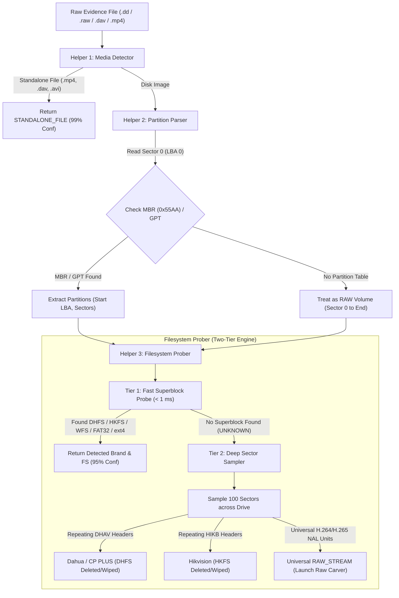

# 🔍 Flow 02: Device & File System Identification

> **Module:** `backend/app/modules/identification/`  
> **Status:** `🔄 In Progress (Step 2 Complete, Step 3 Next)`  
> **Purpose:** Automatically detect the partition layout, proprietary DVR filesystem (DHFS, HKFS, WFS), or standard filesystem (FAT32, exFAT, ext4) from forensic disk images or exported media clips.

---

## 🎯 High-Level Architecture & Core Principles

The Locus identification engine is built with a **Two-Tier Resilient Detection Architecture** designed specifically for real-world forensic crime scenarios.



---

## 🛡️ Real-World Crime & Forensic Scenarios Handled

| Scenario | What Happened to Drive | How Locus Handles It | Forensic Outcome |
| :--- | :--- | :--- | :--- |
| **1. Healthy DVR Hard Drive** | Normal operation | **Tier 1 Fast Probe** finds `"DHFS"` or `"HKFS"` at Sector 2048 in < 1 ms | Exact vendor metadata & channels extracted |
| **2. Suspect Formatted DVR** | Sector 0 erased / cleared | **Tier 2 Deep Sampler** detects thousands of `DHAV` or `HIKB` frame packets deeper in unallocated space | Discovers wiped/deleted footage ready for carving |
| **3. Hardware Bad Sector 0** | Sector 0 physically dead | Deep scan bypasses broken Sector 0 and samples sectors 100+ | Identifies format and recovers remaining drive sectors |
| **4. Carved Sector Dump** | Sliced dump (e.g. Sectors 10,000–50,000) | Deep scan identifies repeating NAL units (`0x00000001` + SPS/IDR) | Flags as `RAW_STREAM` and launches raw video carver |
| **5. Unlisted / Obscure Brand** | Brand from unknown manufacturer | Deep scan identifies universal H.264 / H.265 video packets | Video is **100% playable** and carved without vendor branding |

---

## 🏢 Vendor & Format Support Matrix

### 1. Dedicated DVR Vendors
* **Dahua Technology (`DVRBrand.DAHUA`):**
  * Superblock: `"DHFS"` (`0x44 0x48 0x46 0x53`)
  * Deep Frame Packets: `"DHAV"` (`0x44 0x48 0x41 0x56`) ... `"dhav"` footer
  * Standalone file: `.dav`
* **CP PLUS (`DVRBrand.CP_PLUS`):**
  * Uses Dahua OEM architecture (`DHFS` / `DHAV`).
* **Hikvision & EZVIZ (`DVRBrand.HIKVISION`):**
  * Superblock: `"HKFS"` (`0x48 0x4B 0x46 0x53`)
  * Master Index: `"HIKBTREE"` B+ tree table
  * Deep Cluster Blocks: `"HIKB"` (`0x48 0x49 0x4B 0x42`)
* **WFS / Swann / Xiongmai (`DVRBrand.WFS_GENERIC`):**
  * Superblock: `"WFS\x00"` (`0x57 0x46 0x53 0x00`) or `"WFS 0.4"`

### 2. Standard Storage & Backups
* **FAT32 (`FileSystemType.FAT32`):** MicroSD cards from Wi-Fi cameras (Tapo, Mi 360, dashcams).
* **exFAT (`FileSystemType.EXFAT`):** High-capacity 64GB+ SD cards.
* **NTFS (`FileSystemType.NTFS`):** Windows external backup drives.
* **Linux ext4 (`FileSystemType.EXT4`):** Embedded NVR operating system partitions.
* **Standalone Video Clips:** `.mp4` (`"ftyp"` box), `.avi` (`"RIFF"` header).

### 3. Universal Video Fallback (100% Brand Coverage)
* **Raw H.264 (AVC) Stream (`FileSystemType.RAW_STREAM`):** Start code `0x00000001` + SPS (`0x67`), PPS (`0x68`), IDR Keyframe (`0x65`), P-Frames (`0x41`/`0x61`).
* **Raw H.265 (HEVC / 4K) Stream (`FileSystemType.RAW_STREAM`):** Start code `0x00000001` + VPS (`0x40`), SPS (`0x42`), IDR Keyframes (`0x26`, `0x28`).

---

## 🗂️ Code Organization & Module Structure

```text
backend/app/modules/identification/
├── scanner.py                  # High-level DeviceScanner orchestrator (~70 lines)
├── schemas.py                  # Pydantic request/response models (Step 3)
├── service.py                  # Background worker & DB persistence (Step 3)
├── router.py                   # FastAPI REST & SSE endpoints (Step 4)
└── helpers/
    ├── __init__.py             # Clean exports
    ├── signatures.py           # Magic bytes and NAL unit definitions
    ├── media_detector.py       # Helper 1: Standalone .mp4 / .dav detector
    ├── partition_parser.py     # Helper 2: MBR / GPT sector 0 parser
    └── filesystem_prober.py    # Helper 3: Superblock probe & deep sector sampler
```

---

## 🧪 Automated Test Verification

All scenarios are validated via automated tests in [`backend/tests/test_identification.py`](file:///home/rehanhalai/code/locus/backend/tests/test_identification.py):
* `test_scanner_standalone_mp4` $\rightarrow$ Validates `ftyp` detection.
* `test_scanner_standalone_dahua_dav` $\rightarrow$ Validates single `.dav` file detection.
* `test_scanner_mbr_with_dahua_dhfs` $\rightarrow$ Validates MBR + Dahua DHFS partition mapping.
* `test_scanner_mbr_with_hikvision_hkfs` $\rightarrow$ Validates MBR + Hikvision HKFS mapping.
* `test_scanner_raw_wfs_disk` $\rightarrow$ Validates unpartitioned WFS disk.
* `test_scanner_mbr_with_fat32_sd_card` $\rightarrow$ Validates FAT32 SD card partition.
* `test_scanner_deep_scan_dahua_dhav` $\rightarrow$ Validates deleted/wiped Dahua recovery.
* `test_scanner_deep_scan_hikvision_hikb` $\rightarrow$ Validates deleted/wiped Hikvision recovery.
* `test_scanner_deep_scan_h265_stream` $\rightarrow$ Validates modern 4K H.265 NAL recovery.
